# Performance

## Данные до оптимизации:

### 1. Взаимодействие пользователя - Сортировка по городам

#### 1.1. Commit Duration = 3,3 sec

#### 1.2. Render Duration = 372,2 msec

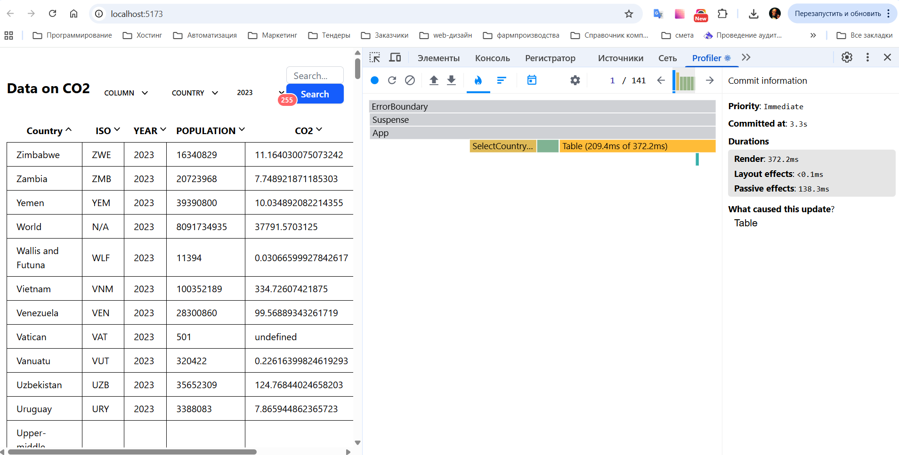
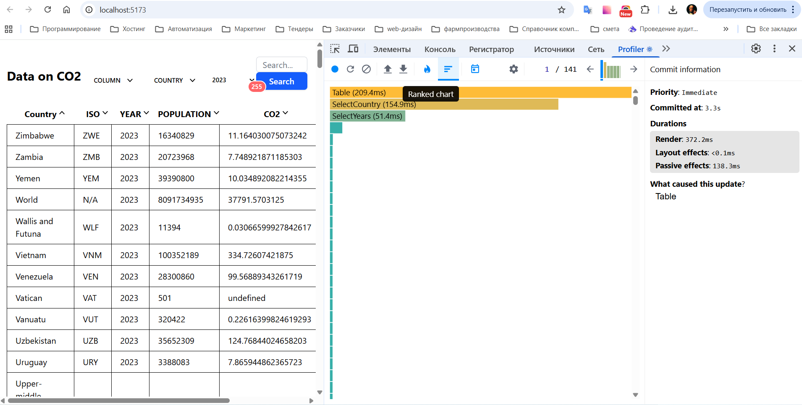
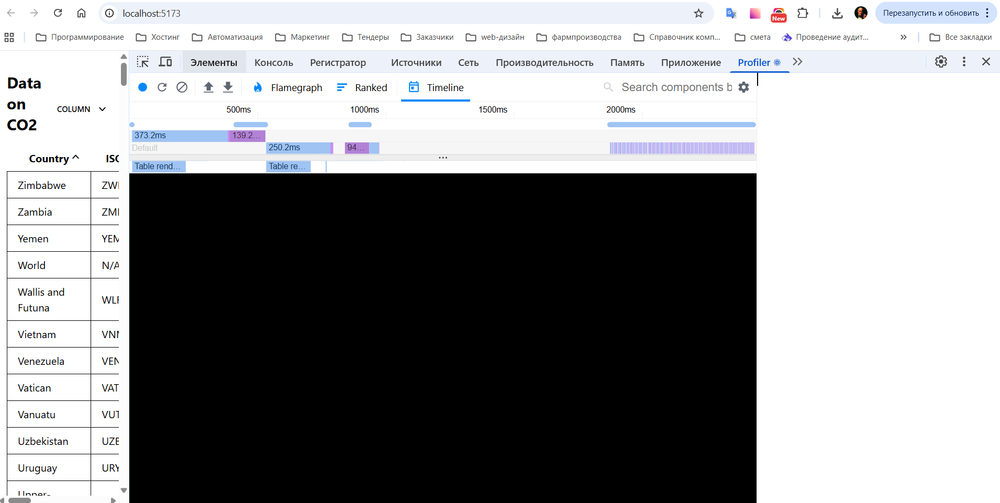

### 2. Взаимодействие пользователя - Изменение года

#### 2.1. Commit Duration = 4,5 sec

#### 2.2. Render Duration = 607,2 msec

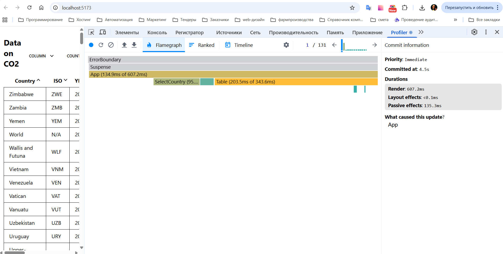
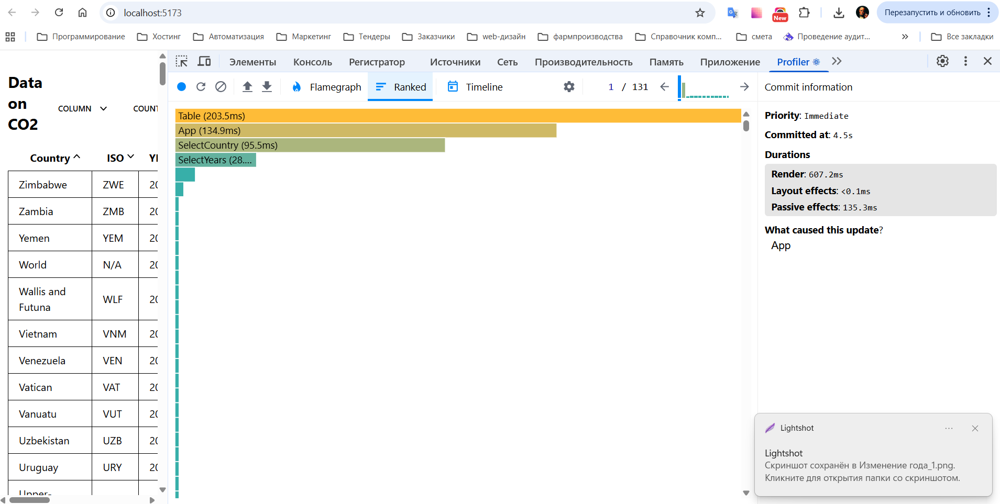
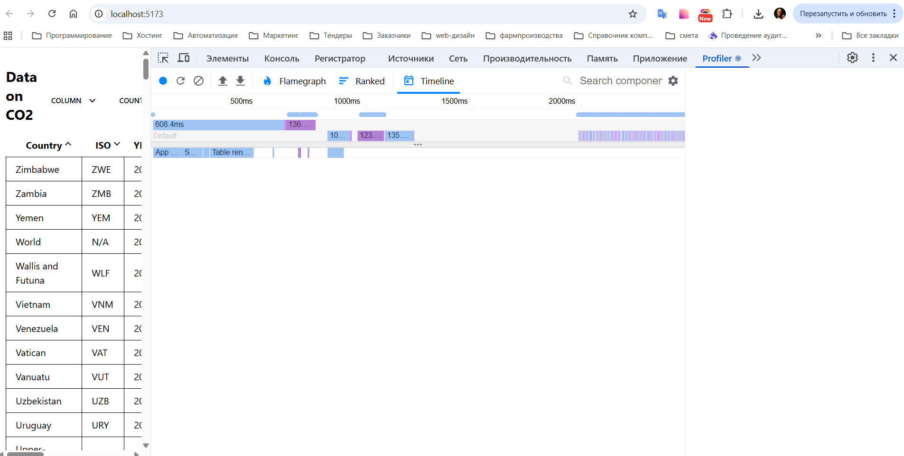

## Данные после оптимизации:

### 1. Взаимодействие пользователя - Сортировка по городам

#### 1.1. Commit Duration = 2,4 sec

#### 1.2. Render Duration = 347,3 msec

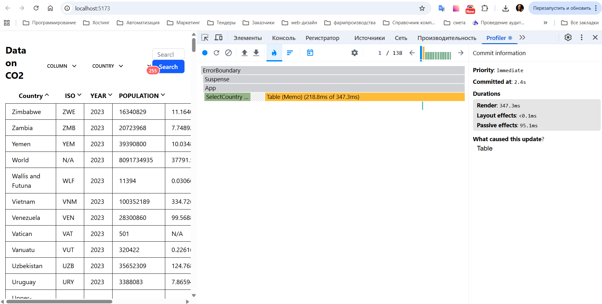
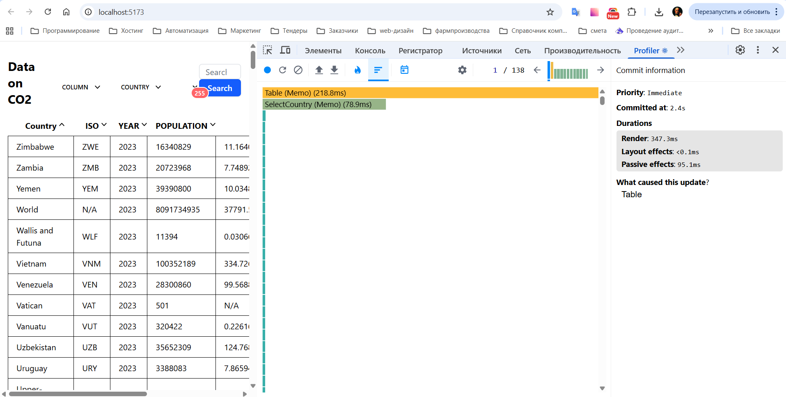
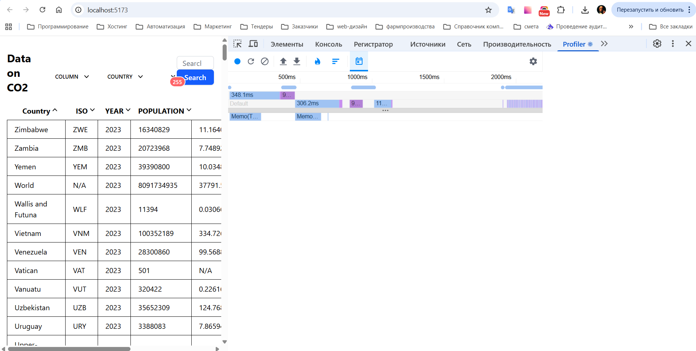

### 2. Взаимодействие пользователя - Изменение года

#### 2.1. Commit Duration = 3,5 sec

#### 2.2. Render Duration = 414,9 msec

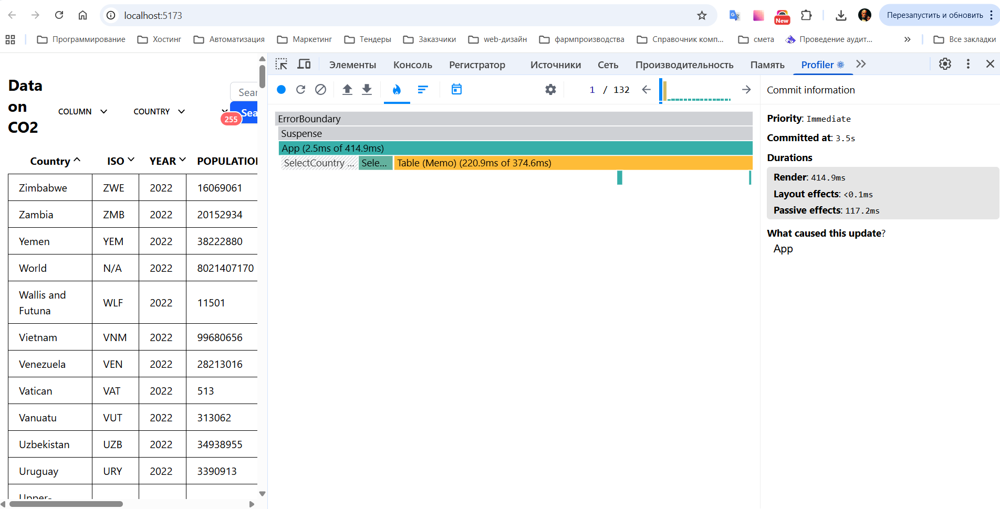
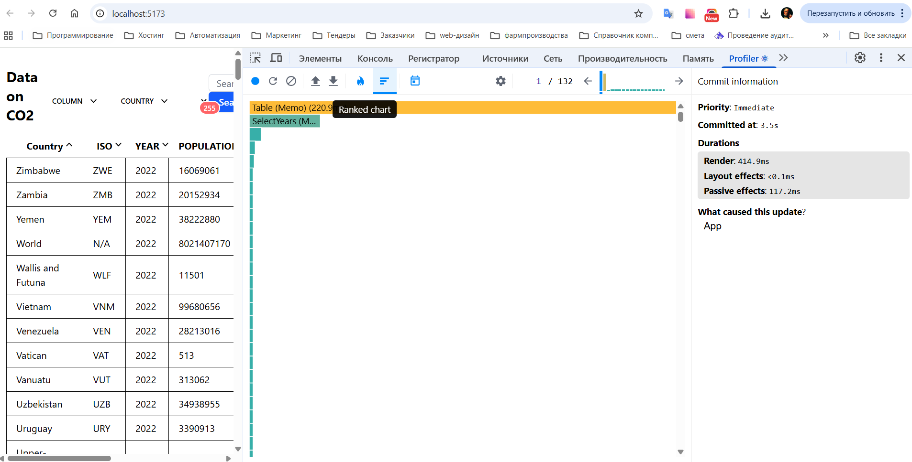
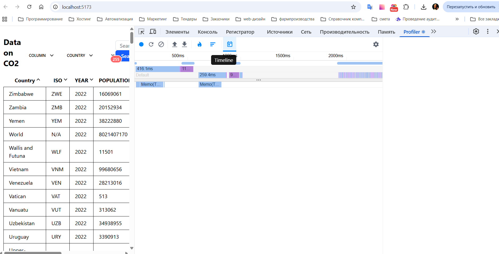
